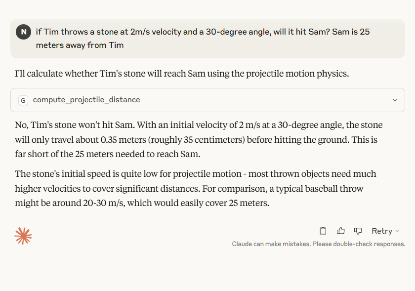
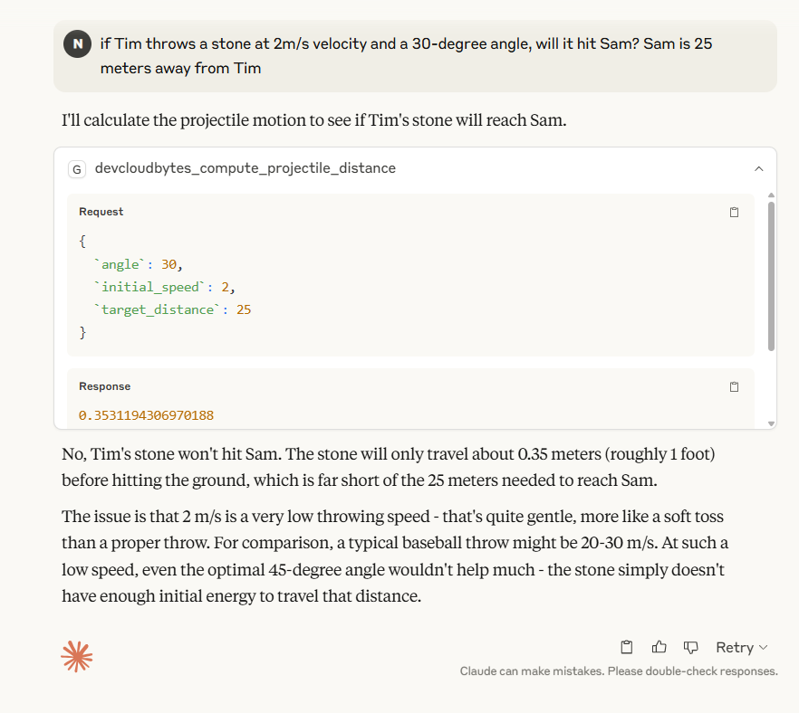

# mcp-example
create your own MCP servers  for different scenarios


## Pre-requisites:

### Node and npm to be installed:

```text
PS C:\Users\offic> node --version
v22.16.0
PS C:\Users\offic> npm --version
10.9.2
```
### Client for chat interface  
https://claude.ai/download

Find the Claude config file: -

Go to Claude Desktop and click on the hamburger menu at the very top left corner of the app. Then go to file and click settings. Finally, go to developer settings and click on the edit config button.

Location for config
```
C:\Users\offic\AppData\Roaming\Claude

```

## adding mcp server code

```
1-sample-mcp-setup-with-claude\app.py
```

### adding claude config changes

```
{
  "mcpServers": {
    "gradio": {
      "command": "npx",
      "args": [
        "mcp-remote",
        "http://127.0.0.1:7860/gradio_api/mcp/sse",
        "--transport",
        "sse-only",
        "--verbose"
      ],
      "logLevel": "debug"
    }
  },
  "logging": {
    "level": "debug",
    "file": "claude_mcp.log"
  }
}
```

### starting mcp server

```
PS D:\2025\wc\devcloudbytes\mcp-example\1-sample-mcp-setup-with-claude> python app.py --log-level DEBUG
2025-06-19 19:01:31,311 - INFO - ==================================================
2025-06-19 19:01:31,311 - INFO - Projectile Calculator Server v1.0
2025-06-19 19:01:31,312 - INFO - Started at 2025-06-19 19:01:31.312529
2025-06-19 19:01:31,312 - INFO - ==================================================
None
2025-06-19 19:01:32,124 - INFO - StreamableHTTP session manager started
* Running on local URL:  http://0.0.0.0:7860
2025-06-19 19:01:32,374 - INFO - HTTP Request: GET https://api.gradio.app/pkg-version "HTTP/1.1 200 OK"
2025-06-19 19:01:34,634 - INFO - HTTP Request: GET http://localhost:7860/gradio_api/startup-events "HTTP/1.1 200 OK"
2025-06-19 19:01:36,680 - INFO - HTTP Request: HEAD http://localhost:7860/ "HTTP/1.1 200 OK"
2025-06-19 19:01:37,518 - INFO - HTTP Request: GET https://api.gradio.app/v3/tunnel-request "HTTP/1.1 200 OK"

Could not create share link. Please check your internet connection or our status page: https://status.gradio.app.

🔨 MCP server (using SSE) running at: http://localhost:7860/gradio_api/mcp/sse
2025-06-19 19:01:48,194 - INFO - Processing request of type ListToolsRequest
2025-06-19 19:01:48,208 - INFO - Processing request of type ListResourcesRequest
2025-06-19 19:01:48,212 - INFO - Processing request of type ListToolsRequest
2025-06-19 19:01:48,236 - INFO - Processing request of type ListPromptsRequest
2025-06-19 19:02:01,177 - INFO - Processing request of type CallToolRequest
2025-06-19 19:02:01,180 - INFO - Result: distance=0.35m, hit=False
```
### start claude client interface and do testing




### explanation of logs 

#### Understanding the Log Output

Initialization logs:
```
2025-06-19 13:27:58,343 - INFO - StreamableHTTP session manager started
* Running on local URL:  http://0.0.0.0:7860
Shows the server starting up correctly
```


Gradio connection attempts:

```
2025-06-19 13:27:58,614 - INFO - HTTP Request: GET https://api.gradio.app/pkg-version
2025-06-19 13:28:03,757 - INFO - HTTP Request: GET https://api.gradio.app/v3/tunnel-request
These are Gradio's attempts to check for updates and create a share link
```


MCP server status:
```
🔨 MCP server (using SSE) running at: http://localhost:7860/gradio_api/mcp/sse
Confirms your MCP server is running properly
```

Tool processing logs:

```
2025-06-19 13:28:15,923 - INFO - Processing request of type ListToolsRequest
2025-06-19 13:28:42,003 - INFO - Processing request of type CallToolRequest
2025-06-19 13:28:42,006 - INFO - Result: distance=0.35m, hit=False
```

### Troubleshooting

- checking for SSE endpoint
  ```
  http://127.0.0.1:7860/gradio_api/mcp/sse
  ```

- checking for mcp interface
```
http://127.0.0.1:7860
```

- checking health status for gradio
  
```
https://status.gradio.app/
```

## Hosting our application

- Register to Huggingface and create new gradio space 
  - https://huggingface.co/spaces/njain50/devcloudbytes
- add `share=True` to app launch method
```
app.launch(mcp_server=True, share=True)
```

- add your mcp code and requirements.txt  to huggingface repo
- https://huggingface.co/spaces/njain50/devcloudbytes/tree/main
- app will run automatically and it will be avaialble at 
  
```
https://reponame-spacename.hf.space/gradio_api/mcp/sse

https://njain50-devcloudbytes.hf.space/gradio_api/mcp/sse

```
- we can verify, it would be pingable now
```
https://njain50-devcloudbytes.hf.space/gradio_api/mcp/sse

event: endpoint
data: /gradio_api/mcp/messages/?session_id=01662e7c9ac04a21b1b4a33070aeb6f4

: ping - 2025-06-20 00:04:28.506667+00:00

: ping - 2025-06-20 00:04:43.508347+00:00

: ping - 2025-06-20 00:04:58.509286+00:00

: ping - 2025-06-20 00:05:13.510384+00:00

: ping - 2025-06-20 00:05:28.511161+00:00

: ping - 2025-06-20 00:05:43.511888+00:00

```
- update Claude config with this url https://njain50-devcloudbytes.hf.space/gradio_api/mcp/sse
  
```
{
  "mcpServers": {
    "gradio": {
      "command": "npx",
      "args": [
        "mcp-remote",
        "https://njain50-devcloudbytes.hf.space/gradio_api/mcp/sse",
        "--transport",
        "sse-only",
        "--verbose"
      ],
      "logLevel": "debug"
    }
  },
  "logging": {
    "level": "debug",
    "file": "claude_mcp.log"
  }
}
```

- verify logs here https://huggingface.co/spaces/njain50/devcloudbytes?logs=container

Build logs
```
Downloading cffi-1.17.1-cp310-cp310-manylinux_2_17_x86_64.manylinux2014_x86_64.whl (446 kB)
Downloading itsdangerous-2.2.0-py3-none-any.whl (16 kB)
Downloading pycparser-2.22-py3-none-any.whl (117 kB)
Installing collected packages: python-dotenv, pycparser, psutil, itsdangerous, httpx-sse, cffi, sse-starlette, pydantic-settings, cryptography, mcp, authlib, spaces

Successfully installed authlib-1.6.0 cffi-1.17.1 cryptography-45.0.4 httpx-sse-0.4.0 itsdangerous-2.2.0 mcp-1.9.3 psutil-5.9.8 pycparser-2.22 pydantic-settings-2.9.1 python-dotenv-1.1.0 spaces-0.37.0 sse-starlette-2.3.6
DONE 2.2s

--> COPY --link --chown=1000 ./ /home/user/app
DONE 0.0s

--> RUN pip freeze > /tmp/freeze.txt
DONE 0.3s

--> COPY --from=pipfreeze --link --chown=1000 /tmp/freeze.txt /tmp/freeze.txt
DONE 0.0s

--> Pushing image
DONE 2.9s

--> Exporting cache
DONE 0.5s
```

Containner logs
```
2025-06-20 02:04:23,811 - INFO - HTTP Request: GET http://0.0.0.0:7861/_app/immutable/chunks/Index.Din3mAig.js "HTTP/1.1 200 OK"
2025-06-20 02:04:23,814 - INFO - HTTP Request: GET http://0.0.0.0:7861/_app/immutable/chunks/Index.DcDnipTh.js "HTTP/1.1 200 OK"
2025-06-20 02:04:23,814 - INFO - HTTP Request: GET http://0.0.0.0:7861/_app/immutable/chunks/Example.BV0hF1Qv.js "HTTP/1.1 200 OK"
2025-06-20 02:04:23,816 - INFO - HTTP Request: GET http://0.0.0.0:7861/_app/immutable/chunks/IconButtonWrapper.DkpBG_NJ.js "HTTP/1.1 200 OK"
2025-06-20 02:04:23,818 - INFO - HTTP Request: GET http://0.0.0.0:7861/_app/immutable/chunks/Index.Lp1UOoeT.js "HTTP/1.1 200 OK"
2025-06-20 02:05:02,519 - INFO - Processing request of type ListResourcesRequest
2025-06-20 02:05:02,520 - INFO - Processing request of type ListToolsRequest
2025-06-20 02:05:02,525 - INFO - Processing request of type ListToolsRequest
2025-06-20 02:05:02,569 - INFO - Processing request of type ListPromptsRequest
2025-06-20 02:06:57,492 - INFO - Processing request of type CallToolRequest
2025-06-20 02:06:57,494 - INFO - Result: distance=0.35m, hit=False
2025-06-20 02:15:03,612 - INFO - Processing request of type ListResourcesRequest
2025-06-20 02:15:03,665 - INFO - Processing request of type ListPromptsRequest
2025-06-20 02:18:39,606 - INFO - HTTP Request: GET http://0.0.0.0:7861/?__theme=system "HTTP/1.1 200 OK"
2025-06-20 02:18:45,811 - INFO - HTTP Request: GET http://0.0.0.0:7861/?__theme=system "HTTP/1.1 304 Not Modified"
2025-06-20 02:18:45,922 - INFO - HTTP Request: GET http://0.0.0.0:7861/?__theme=system "HTTP/1.1 304 Not Modified"
2025-06-20 02:23:43,977 - INFO - HTTP Request: GET http://0.0.0.0:7861/?__theme=system "HTTP/1.1 304 Not Modified"
2025-06-20 02:23:44,056 - INFO - HTTP Request: GET http://0.0.0.0:7861/?__theme=system "HTTP/1.1 304 Not Modified"
```

- Now we can start claude app and do some testing

