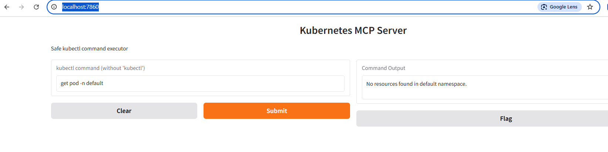
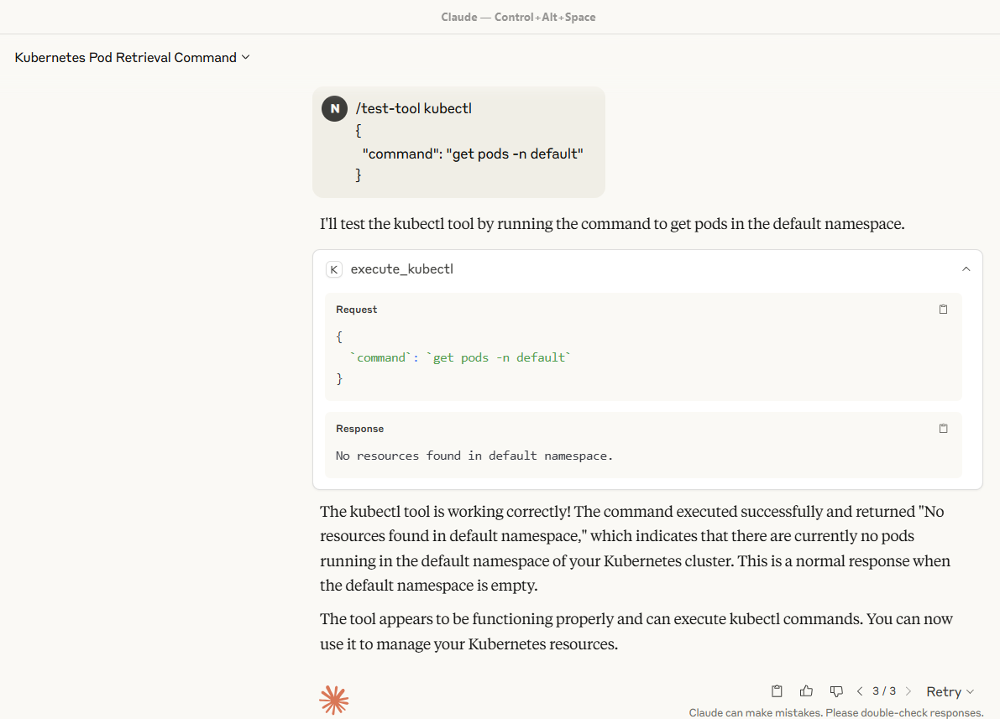
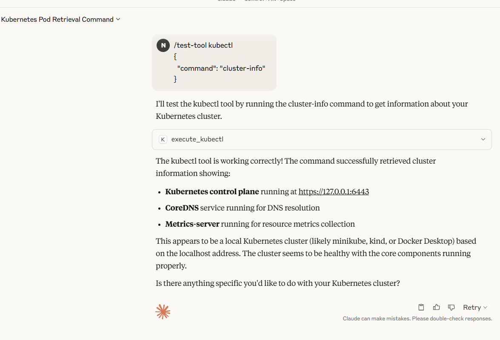

# steps

## adding mcp server code

```
2-kubectl-mcp-claude-sample
```

## create docker image and run

```
docker build -t k8s-mcp .
docker run -p 7860:7860 -v ${env:USERPROFILE}\.kube\config:/root/.kube/config --network host k8s-mcp
```

logs
```
PS D:\2025\wc\devcloudbytes\mcp-example\2-kubectl-mcp-claude-sample> docker run -p 7860:7860 -v ${env:USERPROFILE}\.kube\config:/root/.kube/config --network host k8s-mcp
WARNING: Published ports are discarded when using host network mode
INFO:mcp.server.streamable_http_manager:StreamableHTTP session manager started
INFO:httpx:HTTP Request: GET http://localhost:7860/gradio_api/startup-events "HTTP/1.1 200 OK"
INFO:httpx:HTTP Request: HEAD http://localhost:7860/ "HTTP/1.1 200 OK"
INFO:httpx:HTTP Request: GET https://api.gradio.app/pkg-version "HTTP/1.1 200 OK"
```

## verify if endpoint accessible

```
C:\Users\offic>curl -v http://localhost:7860/gradio_api/mcp/sse
* Host localhost:7860 was resolved.
* IPv6: ::1
* IPv4: 127.0.0.1
*   Trying [::1]:7860...
* Connected to localhost (::1) port 7860
* using HTTP/1.x
> GET /gradio_api/mcp/sse HTTP/1.1
> Host: localhost:7860
> User-Agent: curl/8.12.1
> Accept: */*
>
< HTTP/1.1 200 OK
< date: Fri, 20 Jun 2025 02:51:33 GMT
< server: uvicorn
< cache-control: no-store
< connection: keep-alive
< x-accel-buffering: no
< content-type: text/event-stream; charset=utf-8
< Transfer-Encoding: chunked
<
event: endpoint
data: /gradio_api/mcp/messages/?session_id=b12fa6b00d8a474aa21422cfb6dedd9b

```

## verify if command working at gradio interface

http://localhost:7860/


## configure in Claude client and verify

claude_desktop_config.json
```
{
  "mcpServers": {
    "k8s": {
      "command": "npx",
      "args": [
        "mcp-remote",
        "http://localhost:7860/gradio_api/mcp/sse",
        "--transport",
        "sse-only"
      ]
    }
  }
}
```



