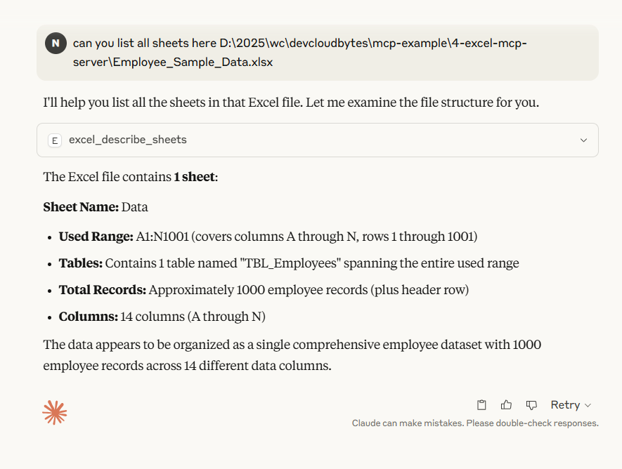

    • The Excel Model Context Protocol (MCP) enables your AI assistant to create, edit, and analyze Excel spreadsheets through natural language commands. Whether you're building a new budget sheet, generating pivot tables, or formatting data, Excel MCP allows your assistant to handle these tasks seamlessly—no manual input required.
    • Added sample employee data sheet to D:\2025\wc\devcloudbytes\mcp-example\4-excel-mcp-server\Employee_Sample_Data.xlsx
    • Added mcp config for excel -> file:///C:/Users/offic/AppData/Roaming/Claude/claude_desktop_config.json
    • Restart Claude
    • 
