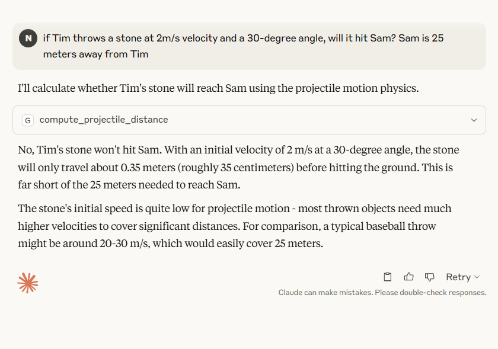

# mcp-example
create your own MCP servers  for different scenarios


## Pre-requisites:

### Node and npm to be installed:

```text
PS C:\Users\offic> node --version
v22.16.0
PS C:\Users\offic> npm --version
10.9.2
```
### Client for chat interface  
https://claude.ai/download

Find the Claude config file: -

Go to Claude Desktop and click on the hamburger menu at the very top left corner of the app. Then go to file and click settings. Finally, go to developer settings and click on the edit config button.

Location for config
```
C:\Users\offic\AppData\Roaming\Claude

```

## adding mcp server code

```
1-sample-mcp-setup-with-claude\app.py
```

### adding claude config changes

```
{
  "mcpServers": {
    "gradio": {
      "command": "npx",
      "args": [
        "mcp-remote",
        "http://127.0.0.1:7860/gradio_api/mcp/sse",
        "--transport",
        "sse-only",
        "--verbose"
      ],
      "logLevel": "debug"
    }
  },
  "logging": {
    "level": "debug",
    "file": "claude_mcp.log"
  }
}
```

### starting mcp server

```
PS D:\2025\wc\devcloudbytes\mcp-example\1-sample-mcp-setup-with-claude> python app.py --log-level DEBUG
2025-06-19 19:01:31,311 - INFO - ==================================================
2025-06-19 19:01:31,311 - INFO - Projectile Calculator Server v1.0
2025-06-19 19:01:31,312 - INFO - Started at 2025-06-19 19:01:31.312529
2025-06-19 19:01:31,312 - INFO - ==================================================
None
2025-06-19 19:01:32,124 - INFO - StreamableHTTP session manager started
* Running on local URL:  http://0.0.0.0:7860
2025-06-19 19:01:32,374 - INFO - HTTP Request: GET https://api.gradio.app/pkg-version "HTTP/1.1 200 OK"
2025-06-19 19:01:34,634 - INFO - HTTP Request: GET http://localhost:7860/gradio_api/startup-events "HTTP/1.1 200 OK"
2025-06-19 19:01:36,680 - INFO - HTTP Request: HEAD http://localhost:7860/ "HTTP/1.1 200 OK"
2025-06-19 19:01:37,518 - INFO - HTTP Request: GET https://api.gradio.app/v3/tunnel-request "HTTP/1.1 200 OK"

Could not create share link. Please check your internet connection or our status page: https://status.gradio.app.

🔨 MCP server (using SSE) running at: http://localhost:7860/gradio_api/mcp/sse
2025-06-19 19:01:48,194 - INFO - Processing request of type ListToolsRequest
2025-06-19 19:01:48,208 - INFO - Processing request of type ListResourcesRequest
2025-06-19 19:01:48,212 - INFO - Processing request of type ListToolsRequest
2025-06-19 19:01:48,236 - INFO - Processing request of type ListPromptsRequest
2025-06-19 19:02:01,177 - INFO - Processing request of type CallToolRequest
2025-06-19 19:02:01,180 - INFO - Result: distance=0.35m, hit=False
```
### start claude client interface and do testing




### explanation of logs 

#### Understanding the Log Output

Initialization logs:
```
2025-06-19 13:27:58,343 - INFO - StreamableHTTP session manager started
* Running on local URL:  http://0.0.0.0:7860
Shows the server starting up correctly
```


Gradio connection attempts:

```
2025-06-19 13:27:58,614 - INFO - HTTP Request: GET https://api.gradio.app/pkg-version
2025-06-19 13:28:03,757 - INFO - HTTP Request: GET https://api.gradio.app/v3/tunnel-request
These are Gradio's attempts to check for updates and create a share link
```


MCP server status:
```
🔨 MCP server (using SSE) running at: http://localhost:7860/gradio_api/mcp/sse
Confirms your MCP server is running properly
```

Tool processing logs:

```
2025-06-19 13:28:15,923 - INFO - Processing request of type ListToolsRequest
2025-06-19 13:28:42,003 - INFO - Processing request of type CallToolRequest
2025-06-19 13:28:42,006 - INFO - Result: distance=0.35m, hit=False
```
